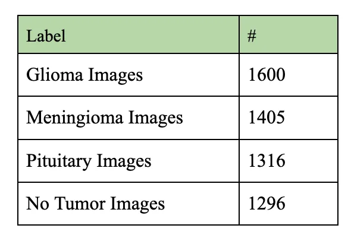
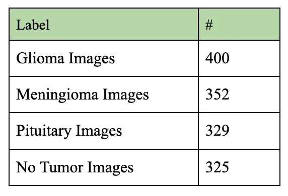
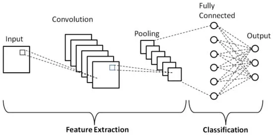
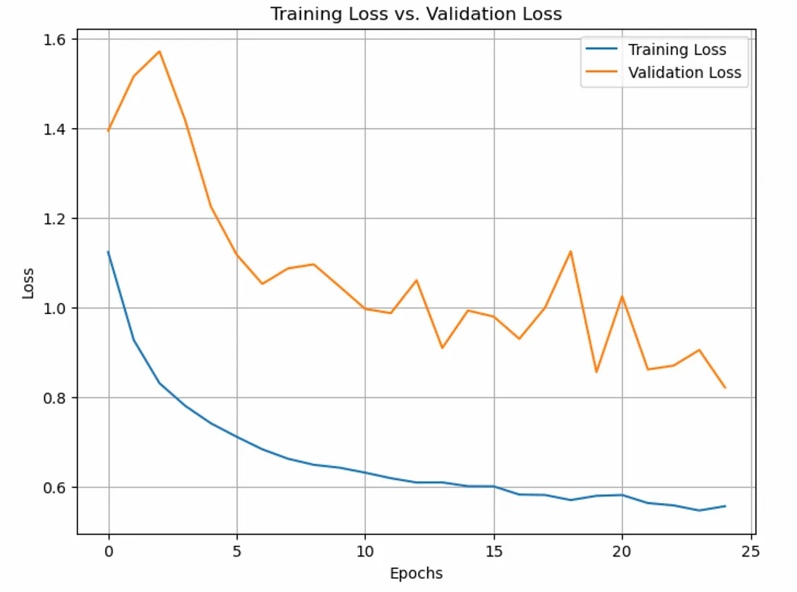
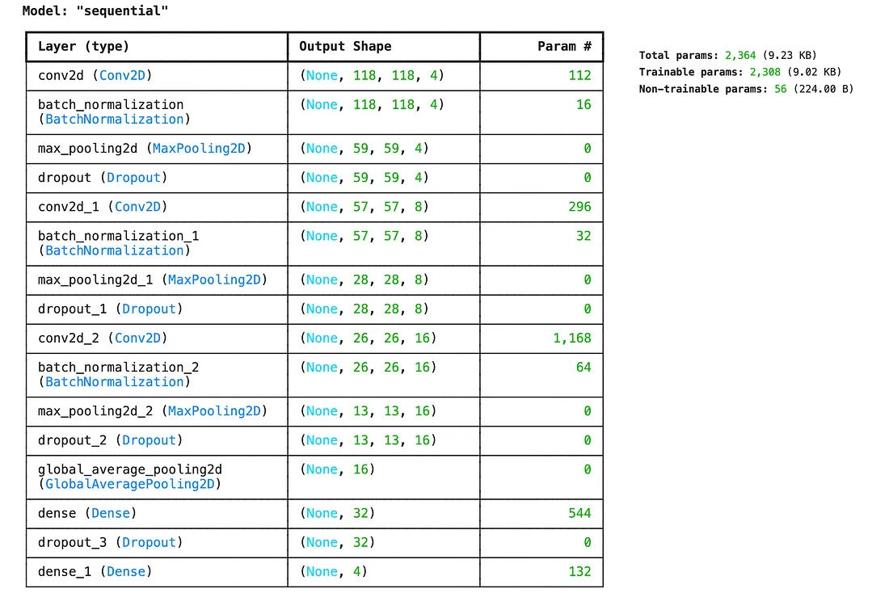
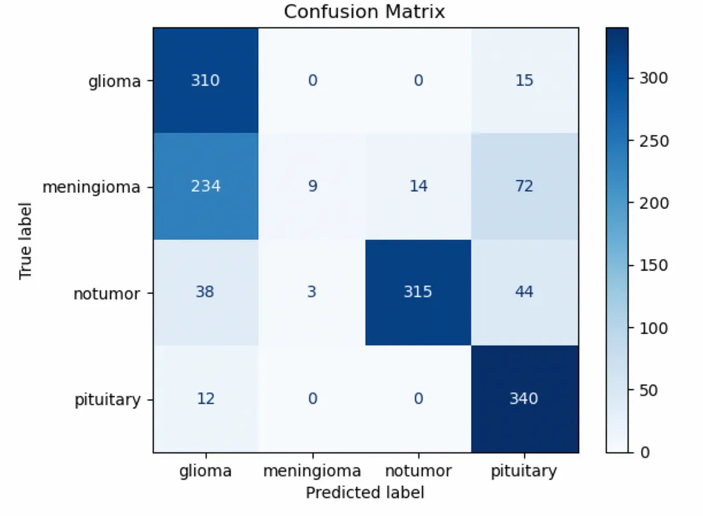
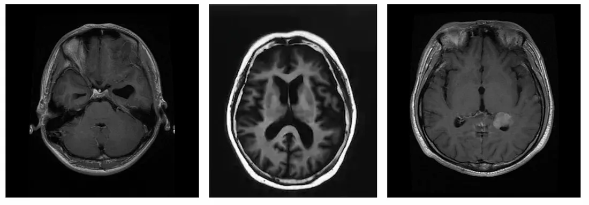
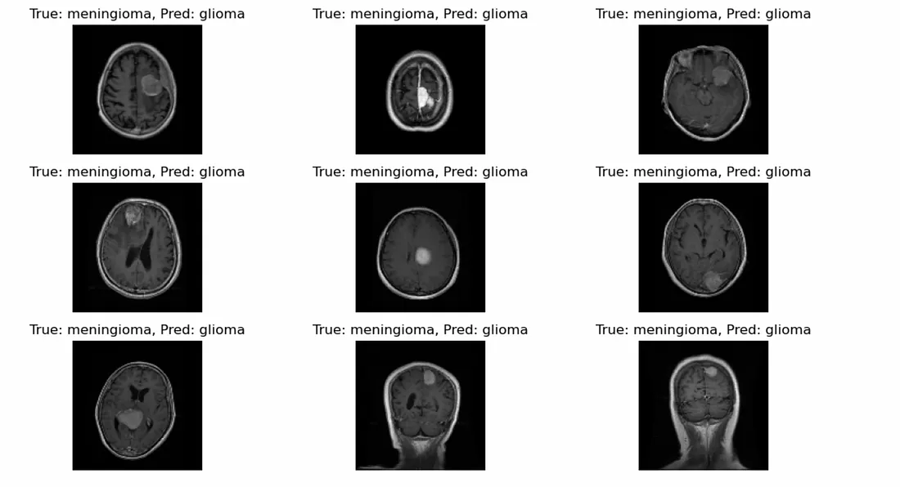
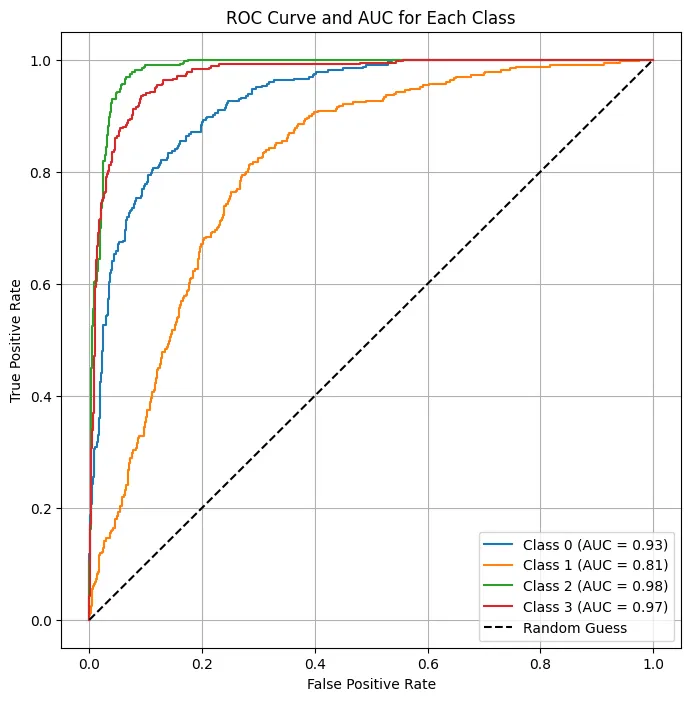

# ANN-FP-Brain-Tumor-Classification

Artificial Neural Networks and Deep Learning Final Project

// 

BLOG FIGURES

Figure 1: Simple chart giving the breakdown of our four classes of training data: Glioma, Meningnoma, Pituitary & No Tumor.


Figure 2: Simple chart giving the breakdown of our four classes of test data: Glioma, Meningnoma, Pituitary & No Tumor.


Figure 3: Simple CNN model example.


Figure 4: Chart displaying out training loss versus our validation loss.


```python
    # Extract loss values from history
    training_loss = history.history['loss']
    validation_loss = history.history['val_loss']

    # Plot the losses
    plt.figure(figsize=(8, 6))
    plt.plot(training_loss, label='Training Loss')
    plt.plot(validation_loss, label='Validation Loss')
    plt.xlabel('Epochs')
    plt.ylabel('Loss')
    plt.title('Training Loss vs. Validation Loss')
    plt.legend()
    plt.grid(True)
    plt.show()
```

Figure 5: Summary of the architecture of our model



```python
    # Compile the model
        model.compile(optimizer='adam',
              loss='categorical_crossentropy',
              metrics=['accuracy'])

    model.summary()
```

Figure 6: Confusion Matrix representing the classifications generated from our model


```python
    from sklearn.metrics import confusion_matrix, ConfusionMatrixDisplay

    # Step 1: Get ground truth labels
    true_labels = []
    for _, labels in test_ds:
        true_labels.extend(labels.numpy())

    # Convert true_labels from one-hot encoding to class indices if necessary
    true_labels = np.argmax(true_labels, axis=1) if len(np.array(true_labels).shape) > 1 else np.array(true_labels)

    # Step 2: Get predicted labels
    predictions = model.predict(test_ds)  # Get all predictions at once
    predicted_labels = np.argmax(predictions, axis=1)

    # Step 3: Create the confusion matrix
    cm = confusion_matrix(true_labels, predicted_labels)

    # Step 4: Visualize the confusion matrix
    disp = ConfusionMatrixDisplay(confusion_matrix=cm, display_labels=['glioma', 'meningioma', 'notumor', 'pituitary'])
    disp.plot(cmap=plt.cm.Blues)
    plt.title("Confusion Matrix")
    plt.show()
```
Figure 7: Some sample data from our data set


```python
    for images, labels in train_ds.take(1):
        plt.figure(figsize=(10, 10))
        for i in range(9):  # Show the first 9 images
            plt.subplot(3, 3, i + 1)
            plt.imshow(images[i].numpy().astype("uint8"))
            plt.title(f"Label: {labels[i].numpy()}")
            plt.axis("off")
        plt.show()
        break
```

Figure 8: An example of some misclassified data from our model


```python
    # Step 3: Visualize the misclassified images
    plt.figure(figsize=(12, 6))
    for i, idx in enumerate(meningioma_correct_indices[:9]):  # Show up to 9 images
        plt.subplot(3, 3, i + 1)
        plt.imshow(images[idx].astype("uint8"))
        plt.title(f"True: meningioma, Pred: meningioma ")
        plt.axis("off")

    plt.tight_layout()
    plt.show()
```

Figure 9: ROC curve demonstrating the performance of our model


```python
from sklearn.metrics import roc_curve, auc

# Step 1: Get true labels and predicted probabilities
true_labels = []
predicted_probs = []

for img_batch, label_batch in test_ds:
    true_labels.extend(label_batch.numpy())
    predicted_probs.extend(model.predict(img_batch))

# Convert to NumPy arrays
true_labels = np.array(true_labels)
predicted_probs = np.array(predicted_probs)

# Step 2: Compute ROC and AUC for each class
n_classes = true_labels.shape[1]  # Number of classes
fpr = {}
tpr = {}
roc_auc = {}

for i in range(n_classes):
    fpr[i], tpr[i], _ = roc_curve(true_labels[:, i], predicted_probs[:, i])
    roc_auc[i] = auc(fpr[i], tpr[i])

# Step 3: Plot the ROC curves for each class
plt.figure(figsize=(8, 8))
for i in range(n_classes):
    plt.plot(fpr[i], tpr[i], label=f"Class {i} (AUC = {roc_auc[i]:.2f})")

# Add diagonal line
plt.plot([0, 1], [0, 1], 'k--', label="Random Guess")

# Plot settings
plt.title("ROC Curve and AUC for Each Class")
plt.xlabel("False Positive Rate")
plt.ylabel("True Positive Rate")
plt.legend(loc="lower right")
plt.grid()
plt.show()
```

//
